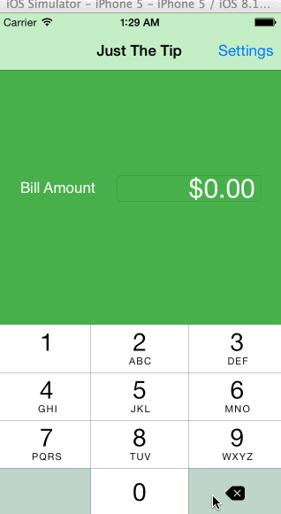
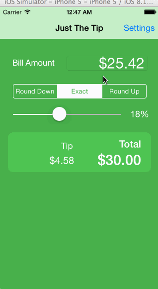

# Tip Calculator Codepath Prework

This is a tip calculator based on the Codepath prework assignment. 

Time Spent: ~15 Hours total. 

Completed Tasks: 
 * [x] Followed Initial Video
 * [x] Added a settings view controller to add an options page to control default tip

Optional Tasks:
 * [x] Added control to the Bill Amount text field to only enter digits, and dynamically updating the displayed text based on inputs (When currency symbols come after amount, additional digits have to be accounted for as coming in after the symbol)
 * [x] Use a slider to enter tip amount range instead of only 3 values
 * [x] Used a segemented control to add rounding options
 * [x] Added animation blocks 
 * [x] Enhanced UI with background color and grouping elements with UIView

Entering Values

Updating settings

GIF created with [LiceCap](http://www.cockos.com/licecap/).